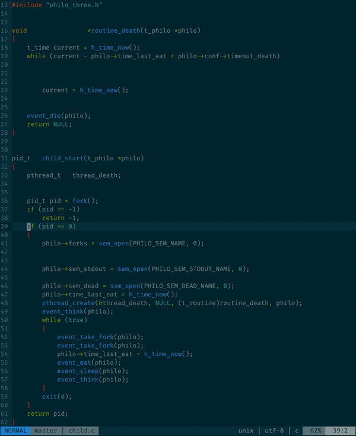

# c\_formatter\_42.vim

Vim plugin for [c\_formatter\_42](https://github.com/dawnbeen/c_formatter_42).



## Installation

First you need to install [`c_formatter_42`](https://github.com/dawnbeen/c_formatter_42).  

```sh
$ git clone https://github.com/dawnbeen/c_formatter_42
$ cd c_formatter_42
$ ./c_formatter_42 --install
```

### Manual

```sh
git clone https://github.com/cacharle/c_formatter_42.vim
cd c_formatter_42.vim
./install
```

### [Plug](https://github.com/junegunn/vim-plug)

```vim
call plug#begin()
    Plug 'cacharle/c_formatter_42.vim'
call plug#end()
```

## Usage

Execute `:CFormatter42` or press `F2` to format the current file.

## Configuration

Add the following lines to your `.vimrc` if you want to enable these options.

### Default formatter

Set `c_formatter_42` has the default formatter (you can use `gg=G` or enter visual mode and `=`).

```
let g:c_formatter_42_set_equalprg=1
```

### Disable format on save

```
let g:c_formatter_42_format_on_save=0
```
